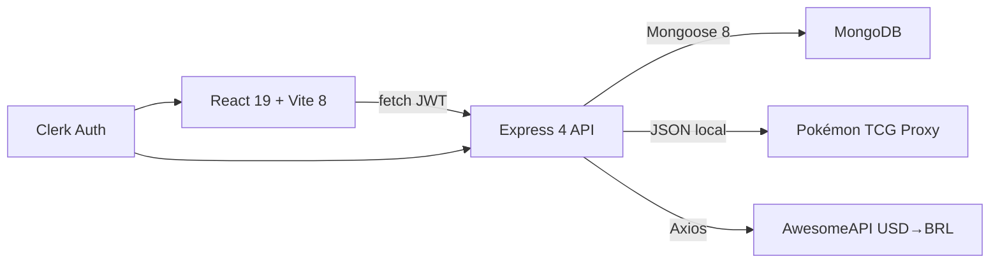
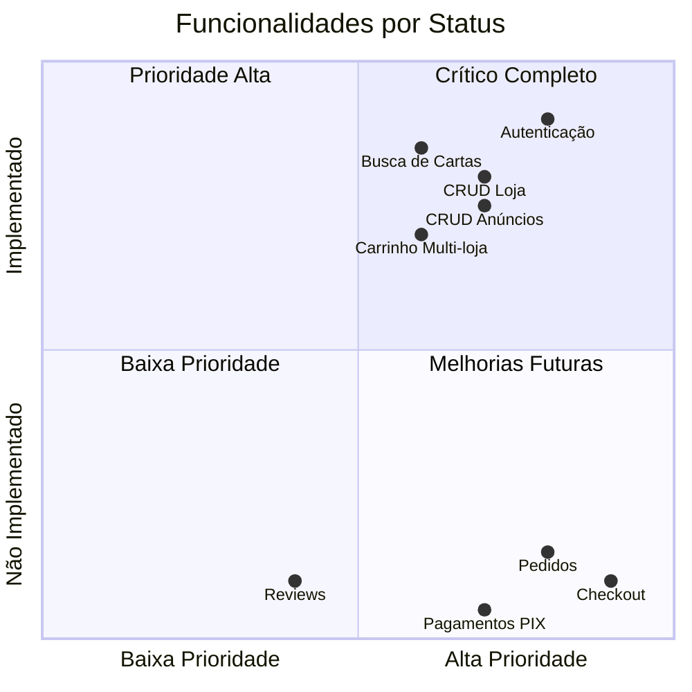

# 01 — Visão Geral do Produto

## 1. Nome do Projeto
**TCG Marketplace** — Marketplace brasileiro de cartas Pokémon TCG.

## 2. Objetivo
Plataforma que conecta compradores e vendedores de cartas Pokémon TCG no Brasil, com suporte a certificação (PSA/CGC/BGS), carrinho multi-loja e preços de referência internacionais convertidos para reais.

## 3. Público-Alvo
- Colecionadores brasileiros de Pokémon TCG
- Vendedores especializados (lojas físicas e online)
- Investidores em cartas raras
- Jogadores competitivos

## 4. Diferenciais Competitivos
- **Carrinho multi-loja**: compre de vários vendedores em um só checkout
- **Preços de referência**: Cardmarket e TCGPlayer convertidos para BRL
- **Certificação integrada**: PSA, CGC, BGS visível nos anúncios
- **Foco exclusivo**: 100% Pokémon TCG
- **Interface em português**: estados brasileiros, moeda local, linguagem do domínio

## 5. Stack Tecnológica

## 6. Funcionalidades por Ator

## 7. Roadmap Resumido

| Fase | Nome | Status |
|------|------|--------|
| 1 | Fundação (Auth, Loja, Dashboard) | ✅ Completo |
| 2 | Anúncios e Carrinho | ✅ Completo |
| 3 | Checkout e Pedidos | ❌ Não iniciado |
| 4 | Pagamentos | ❌ Não iniciado |
| 5 | Reviews e Qualidade | ❌ Não iniciado |

## 8. Métricas do Projeto

| Métrica | Valor |
|---------|-------|
| Páginas frontend | 12 |
| Rotas de API | 20 |
| Modelos MongoDB | 5 |
| Testes | 0 |
| Bugs conhecidos | 10 |
| Console.log | ~88 |
| Funcionalidades implementadas | ~35 |
| Funcionalidades pendentes | ~31 |
