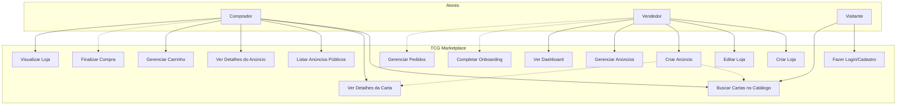

# 03 — Casos de Uso (UML)

## Diagrama de Casos de Uso

**Legenda:** Linha sólida = implementado | Linha tracejada = não implementado / futuro

---

## Especificação dos Casos de Uso

### UC01 — Buscar Cartas no Catálogo

| Campo | Valor |
|-------|-------|
| **Ator** | Comprador, Visitante |
| **Pré-condição** | Nenhuma |
| **Fluxo principal** | 1. Usuário acessa `/search` ou `/new-listing` 2. Preenche filtros (nome, número, set, raridade) 3. Sistema busca no proxy local JSON 4. Sistema exibe resultados |
| **Fluxo alternativo** | Nenhum resultado: exibe "Nenhuma carta encontrada" |
| **Pós-condição** | Lista de cartas exibida |
| **Status** | ✅ Implementado |

### UC02 — Ver Detalhes da Carta

| Campo | Valor |
|-------|-------|
| **Ator** | Comprador |
| **Pré-condição** | Carta selecionada na busca |
| **Fluxo principal** | 1. Usuário clica em carta 2. Sistema exibe `/card/:id` com imagem, set, número, raridade, artista 3. Sistema exibe preços de referência (Cardmarket, TCGPlayer) em BRL |
| **Pós-condição** | Detalhes da carta exibidos |
| **Status** | ✅ Implementado |

### UC03 — Listar Anúncios Públicos

| Campo | Valor |
|-------|-------|
| **Ator** | Comprador |
| **Pré-condição** | Nenhuma |
| **Fluxo principal** | 1. Usuário acessa `/anuncios` 2. Sistema busca listings com status `active` 3. Sistema exibe em grid ou lista 4. Usuário pode filtrar por preço, condição, certificada, loja |
| **Pós-condição** | Lista de anúncios exibida |
| **Status** | ✅ Implementado |

### UC04 — Ver Detalhes do Anúncio

| Campo | Valor |
|-------|-------|
| **Ator** | Comprador |
| **Pré-condição** | Anúncio existe e está ativo |
| **Fluxo principal** | 1. Usuário clica em anúncio 2. Sistema exibe `/listing/:id` com nome, preço, condição, idioma, fotos em carrossel, descrição, defeitos, entrega, loja 3. Views incrementado |
| **Pós-condição** | Detalhes do anúncio exibidos |
| **Status** | ✅ Implementado |

### UC05 — Gerenciar Carrinho

| Campo | Valor |
|-------|-------|
| **Ator** | Comprador (autenticado) |
| **Pré-condição** | Usuário logado |
| **Fluxo principal** | 1. Usuário adiciona item ao carrinho 2. Sistema valida: anúncio ativo e com estoque 3. Sistema impede duplicatas 4. Usuário vê carrinho em `/cart` agrupado por loja 5. Usuário remove itens |
| **Pós-condição** | Carrinho atualizado no backend |
| **Status** | ✅ Implementado |

### UC06 — Finalizar Compra ❌

| Campo | Valor |
|-------|-------|
| **Ator** | Comprador |
| **Pré-condição** | Carrinho com itens |
| **Fluxo principal** | 1. Usuário clica "Finalizar Compra" 2. Sistema exibe formulário de endereço 3. Sistema calcula frete 4. Usuário escolhe pagamento 5. Sistema cria pedido |
| **Status** | ❌ Não implementado (stub) |

### UC07 — Visualizar Loja

| Campo | Valor |
|-------|-------|
| **Ator** | Comprador |
| **Pré-condição** | Loja existe e está ativa |
| **Fluxo principal** | 1. Usuário acessa `/store/:slug` 2. Sistema busca loja por slug 3. Sistema exibe informações da loja e anúncios |
| **Status** | 🐛 Dados mockados (não conecta ao backend) |

### UC08 — Criar Loja

| Campo | Valor |
|-------|-------|
| **Ator** | Vendedor (autenticado) |
| **Pré-condição** | Usuário não possui loja |
| **Fluxo principal** | 1. Usuário acessa `/store/create` 2. Preenche nome, slug (auto-gerado), logo, descrição, cidade, estado 3. Sistema valida slug único 4. Sistema cria loja com status `draft` |
| **Pós-condição** | Loja criada, redireciona ao dashboard |
| **Status** | ✅ Implementado |

### UC09 — Editar Loja

| Campo | Valor |
|-------|-------|
| **Ator** | Vendedor |
| **Pré-condição** | Possui loja |
| **Fluxo principal** | 1. Usuário acessa `/store/edit` 2. Edita campos 3. Sistema valida imagens (banner ≥800×200, logo ≥100×100) 4. Salva alterações |
| **Status** | ✅ Implementado (contexto local, sem persistência via API) |

### UC10 — Criar Anúncio

| Campo | Valor |
|-------|-------|
| **Ator** | Vendedor |
| **Pré-condição** | Possui loja |
| **Fluxo principal** | 1. Usuário acessa `/new-listing` 2. Busca e seleciona carta 3. Preenche dados (idioma, condição, preço, etc.) 4. Envia 4 fotos obrigatórias (stepper) 5. Sistema cria listing com status `active` 6. Redireciona ao detalhe do anúncio |
| **Pós-condição** | Anúncio criado, `store.stats.activeListings` incrementado |
| **Status** | ✅ Implementado |
