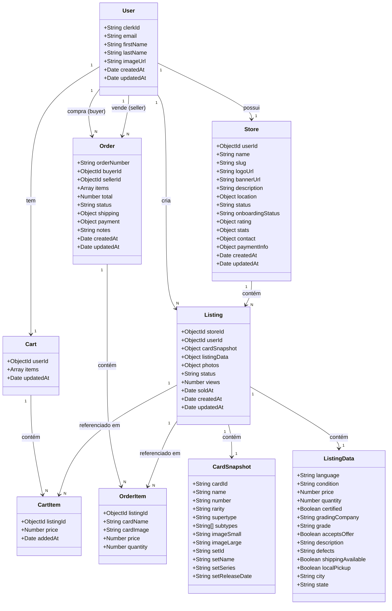

# 04 — Diagrama de Classes (UML)

## Classes do Domínio

## Relacionamentos

| Classe A | Relacionamento | Classe B | Tipo | Regra |
|----------|---------------|----------|------|-------|
| User | → | Store | 1:1 | Um usuário = uma loja |
| User | → | Listing | 1:N | Um usuário tem N anúncios |
| User | → | Cart | 1:1 | Um carrinho por usuário |
| User | → | Order (buyer) | 1:N | Um usuário faz N pedidos |
| User | → | Order (seller) | 1:N | Um usuário vende N pedidos |
| Store | → | Listing | 1:N | Uma loja tem N anúncios |
| Listing | → | CartItem | 1:N | Um anúncio em N carrinhos |
| Listing | → | OrderItem | 1:N | Um anúncio em N pedidos |
| Cart | → | CartItem | composição | Itens embutidos no carrinho |
| Order | → | OrderItem | composição | Itens embutidos no pedido |

## Notas Técnicas

- `CardSnapshot` e `ListingData` são objetos embutidos (embedded) em `Listing`, não coleções separadas
- `CartItem` é um subdocumento embutido em `Cart`
- `OrderItem` é um subdocumento embutido em `Order`
- `Order` tem modelo definido mas **não tem rotas nem controllers** implementados
