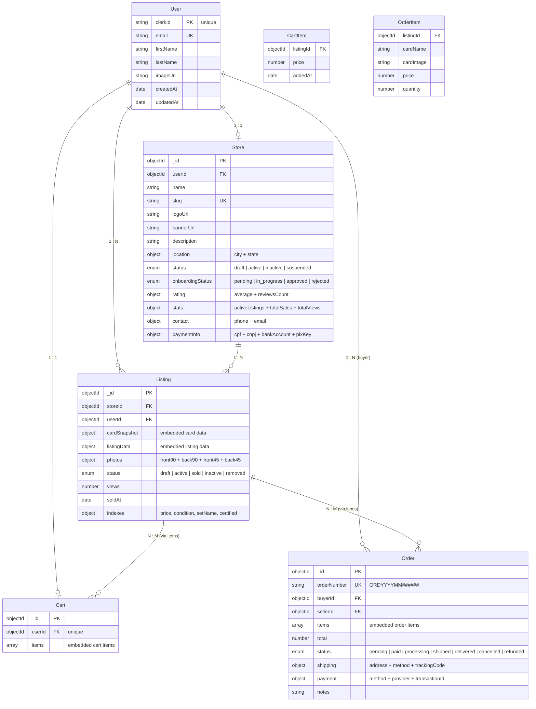

# 05 — Modelo Entidade-Relacionamento (MER)

## Diagrama MER

## Especificação das Coleções

### Coleção: `users`
| Campo | Tipo | Restrições |
|-------|------|-----------|
| _id | ObjectId | PK, auto |
| clerkId | String | **unique**, indexado |
| email | String | **unique**, obrigatório |
| firstName | String | opcional |
| lastName | String | opcional |
| imageUrl | String | opcional |

### Coleção: `stores`
| Campo | Tipo | Restrições |
|-------|------|-----------|
| _id | ObjectId | PK, auto |
| userId | ObjectId | FK → users, **unique** (1:1) |
| name | String | obrigatório |
| slug | String | **unique**, lowercase |
| status | String | enum: draft, active, inactive, suspended |

### Coleção: `listings`
| Campo | Tipo | Restrições |
|-------|------|-----------|
| _id | ObjectId | PK, auto |
| storeId | ObjectId | FK → stores, indexado |
| userId | ObjectId | FK → users, indexado |
| listingData.price | Number | indexado |
| listingData.condition | String | indexado |
| listingData.certified | Boolean | indexado |
| cardSnapshot.setName | String | indexado |
| status | String | enum: draft, active, sold, inactive, removed |

### Coleção: `carts`
| Campo | Tipo | Restrições |
|-------|------|-----------|
| _id | ObjectId | PK, auto |
| userId | ObjectId | FK → users, **unique** (1:1) |
| items[].listingId | ObjectId | FK → listings |
| items[].price | Number | min: 0 |

### Coleção: `orders`
| Campo | Tipo | Restrições |
|-------|------|-----------|
| _id | ObjectId | PK, auto |
| orderNumber | String | **unique**, auto-gerado |
| buyerId | ObjectId | FK → users |
| sellerId | ObjectId | FK → users |
| total | Number | obrigatório |
| status | String | enum: 7 estados |

## Notas sobre o Modelo

1. **User → Store é 1:1** — cada usuário pode ter no máximo uma loja
2. **Cart usa userId unique** — garante 1 carrinho por usuário
3. **Itens embutidos** (embedded) em Cart e Order — sem coleção separada para items
4. **CardSnapshot** é cópia imutável dos dados da carta no momento da criação do anúncio
5. **Order não tem controller** — modelo definido mas sem rotas de API
