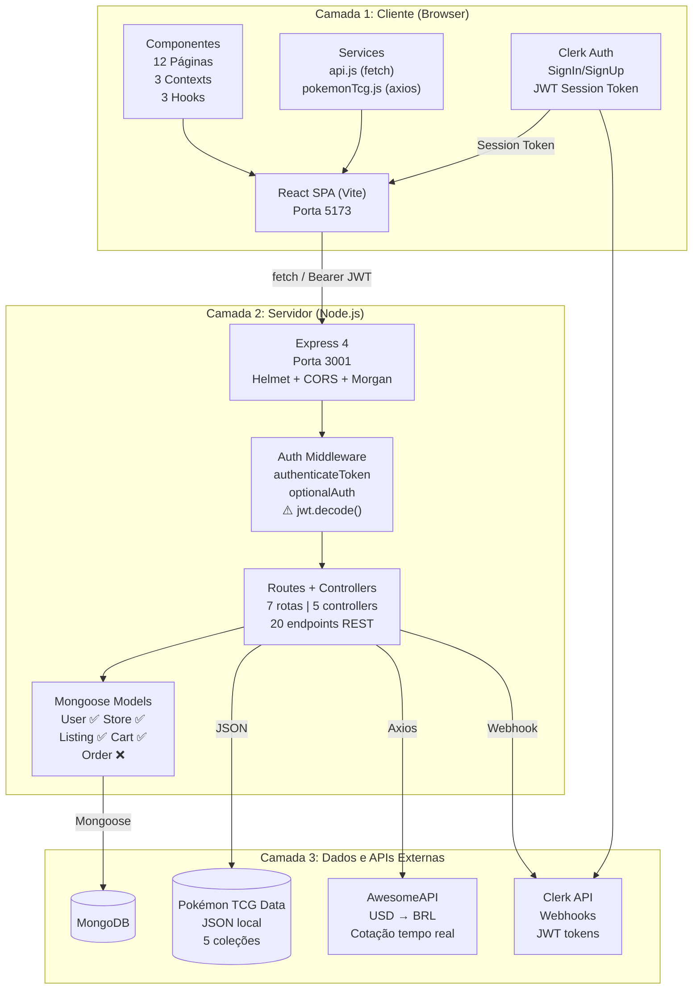
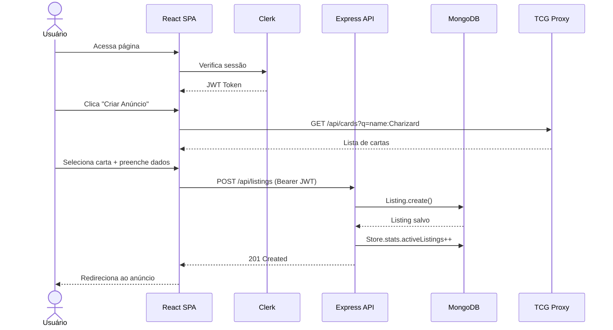
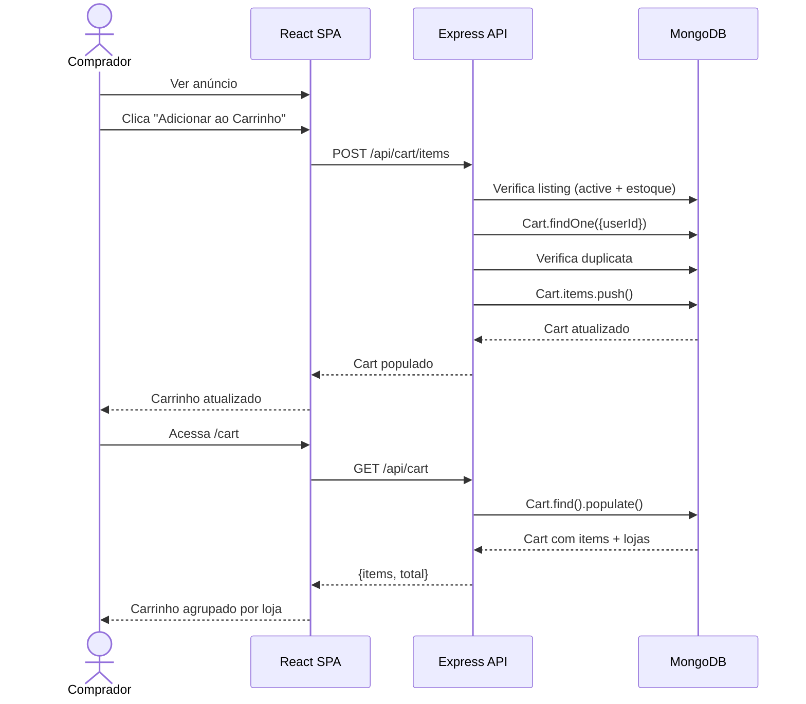

# 06 — Arquitetura do Sistema

## Diagrama de Arquitetura

## Fluxo de Requisição Típico

## Fluxo de Carrinho

## Mapa de Dependências entre Camadas

| Camada | Depende de | Tipo |
|--------|-----------|------|
| React SPA | Clerk React | Biblioteca |
| React SPA | Express API | HTTP (fetch) |
| React SPA | Pokémon TCG Proxy | HTTP (axios) |
| React SPA | AwesomeAPI | HTTP (axios) |
| Express API | MongoDB | Mongoose ODM |
| Express API | Clerk JWT | jsonwebtoken |
| Express API | Pokémon TCG Data | JSON file |
| Express API | AwesomeAPI | HTTP (axios) |

## Segurança

- ✅ Autenticação via Clerk (JWT externo)
- ✅ CORS configurado para localhost:5173
- ✅ Helmet (headers de segurança)
- ⚠️ `jwt.decode()` em vez de `jwt.verify()` — **não verifica assinatura do token**
- ⚠️ Chave secreta do Clerk no backend é placeholder

## Performance

- ✅ Dados de cartas em JSON local (sem latência externa)
- ✅ Cache global em memória para sets, raridades e cotação USD
- ✅ Paginação na API pública (default 20 itens)
