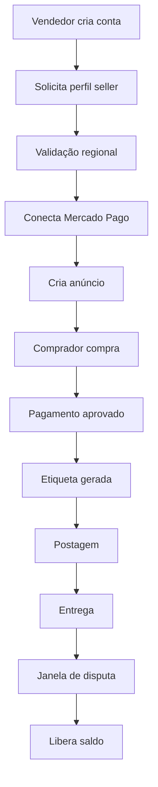

# Marketplace Pokémon — Especificação Funcional (AI-Friendly)

> Documento reorganizado para consumo por IA, LLMs, agentes, geração de código, documentação técnica e planejamento de produto.

## Contexto

Marketplace C2C (consumer-to-consumer) para cartas Pokémon.

### Stack operacional definida
- PSP: Mercado Pago
- Logística: Melhor Envio
- Modelo: Marketplace entre usuários
- Escopo inicial: Sudeste
- Categorias: Certified e Regular

---

## Resumo Executivo

### Objetivo
Construir um marketplace seguro para compra e venda de cartas Pokémon entre usuários.

### Escopo MVP
- Cadastro de usuários
- Cadastro de vendedores
- Publicação de anúncios
- Checkout
- Split de pagamento
- Frete e rastreio
- Retenção de saldo
- Disputas
- Leilão

---

## Decisões Confirmadas

### Marketplace
- Plataforma não custodia itens
- Plataforma não autentica fisicamente itens
- Plataforma não realiza transporte

### Categorias
#### Regular
- Limite: R$300

#### Certified
- Revisão manual ≥ R$500
- Revisão reforçada ≥ R$1.500

### Certificadoras aceitas
- PSA
- BGS
- CGC

### Provas obrigatórias
#### Regular
- Frente
- Verso
- Foto inclinada
- Teste de luz
- Descrição de defeitos

#### Certified
- Frente
- Verso
- Número do certificado
- Nota
- Certificadora

---

## Regras de Risco

### Vendedor novo
- Máx. anúncio: R$500
- Máx. ativos: R$2.000

### Evolução
- 3–5 pedidos sem disputa → aumento de limites
- Histórico positivo → vendedor confiável

### Suspensão
- 4+ disputas confirmadas
- Taxa > 8%
- Fraude confirmada

---

## Arquitetura de Domínio

### Entidades

```text
User
Seller
Listing
Order
Shipment
ShipmentEvent
Dispute
Payout
```

---

## Fluxo Principal



---

## Banco de Dados

Abaixo segue o conteúdo original preservado para referência completa.

---

## Visão geral

Documento-base para organização do marketplace no Notion.

Objetivo: consolidar políticas, fluxos, decisões operacionais e estrutura inicial de implementação do marketplace de cartas Pokémon.

Observação: campos sem definição final podem permanecer em aberto para preenchimento posterior.

---

### Objetivo do projeto

Construir um marketplace de cartas Pokémon entre usuários, com foco inicial em operação segura, previsível e escalável, começando por uma cobertura regional reduzida e regras de proteção para pagamento, envio e disputa.

### Escopo do MVP

- Marketplace entre usuários
- Publicação de anúncios
- Compra e pagamento online
- Split/repasse ao vendedor
- Geração de frete e rastreio
- Retenção e liberação de saldo
- Mediação de disputas
- Operação regional limitada no início
- Sistema de Leilão

### Decisões atuais do MVP

- Modelo: marketplace entre usuários
- PSP principal: Mercado Pago
- Hub logístico principal: Melhor Envio
- Operação inicial regional: Sudeste ou recorte semelhante
- Regras diferentes para cartas certificadas e cartas comuns
- Retenção de saldo por categoria e risco

### Premissas operacionais

- A plataforma não armazena os itens
- A plataforma não autentica fisicamente os itens
- A plataforma não transporta os itens
- O vendedor continua responsável por postagem e embalagem
- O comprador continua responsável por acompanhar entrega e contestar no prazo

---

## 1. Definir políticas

---

### 1.1 Política do modelo do marketplace

**Objetivo**

Definir com clareza o papel da plataforma, do vendedor e do comprador dentro da operação.

**Definição**

A plataforma funcionará como um marketplace entre usuários, atuando como intermediadora da transação, mas sem armazenar, coletar fisicamente, autenticar fisicamente ou transportar os itens.

**Responsabilidades da plataforma**

- anúncio
- pagamento
- split/repasse
- geração de frete/rastreio
- retenção/liberação de saldo
- mediação de disputas

**Responsabilidades do vendedor**

- anunciar corretamente
- enviar o item correto
- embalar adequadamente
- postar no prazo

**Responsabilidades do comprador**

- informar endereço correto
- acompanhar entrega
- contestar dentro do prazo

**Decisão atual**

A plataforma será intermediadora da transação e da operação financeira/logística, mas não será custodiante física do item.

**Pontos em aberto**

1. Haverá revisão manual de anúncios em categorias de maior risco?
2. Haverá teto de valor por vendedor novo?
3. Haverá suspensão automática em caso de muitas disputas?

**Impacto no produto**

- termos de uso precisam refletir esse papel
- fluxo de disputa deve seguir essa divisão de responsabilidades
- páginas de ajuda devem explicar o que a plataforma faz e o que não faz

### ✅ Decisão final (padrão do MVP)

#### 1) Revisão manual de anúncios

1. Anúncios certificados a partir de **R$ 500** entram em revisão manual.
2. Anúncios acima de **R$ 1.500** (ou com sinais de risco) entram em revisão reforçada.
3. A revisão valida documentação, legibilidade, consistência e sinais visuais de fraude.
4. Casos sensíveis podem ser escalados para análise especializada.

#### 2) Limites por maturidade do vendedor

1. Vendedor novo
    - valor máximo por anúncio: **R$ 500**
    - valor máximo em anúncios ativos: **R$ 2.000**
    - revisão manual para anúncio certificado a partir de **R$ 500**
    - retenção de saldo mais conservadora
2. Vendedor com primeiras vendas concluídas
    - após **3 a 5 pedidos entregues sem disputa**
    - valor máximo por anúncio: **R$ 1.500**
    - limite total ativo maior
3. Vendedor confiável
    - após histórico bom, sem disputas relevantes e com documentação validada
    - limite mais alto (ou flexível) conforme score

#### 3) Regras de alerta e suspensão por disputas

1. Alerta
    - **2 disputas confirmadas** nos últimos **60 dias**, ou
    - taxa de disputa confirmada acima de **3%** (com pelo menos **10 pedidos concluídos**)
2. Restrição leve
    - **3 disputas confirmadas** nos últimos **90 dias**, ou
    - taxa acima de **5%** (com pelo menos **20 pedidos concluídos**)
3. Suspensão automática
    - **4+ disputas confirmadas** nos últimos **120 dias** e taxa acima de **8%** (com pelo menos **20 pedidos concluídos**)
    - fraude confirmada (caso crítico)

---

### 1.2 Política de tipos de anúncio

**Objetivo**

Separar anúncios por nível de risco, valor e exigência de prova.

**Definição**

A plataforma terá dois trilhos principais de anúncio:

- cartas certificadas
- cartas comuns / baratas

#### Cartas certificadas

**Regras**

- exigem certificado/graduação
- exigem número do certificado
- exigem fotos reais da slab/certificação
- ticket mais alto permitido
- retenção de saldo maior
- disputa mais rígida

#### Cartas comuns / baratas

**Regras**

- exigem fotos reais
- exigem teste de luz / marcas visuais
- exigem descrição padronizada de estado
- valor máximo por anúncio nessa categoria
- retenção menor
- fluxo mais simples

**Decisão atual**

Criar categoria obrigatória no anúncio com dois valores iniciais:

- certified
- regular

**Pontos em aberto**

- qual será o valor máximo da categoria comum?
- quais certificadoras serão aceitas?

**Impacto no produto**

- formulário do anúncio muda conforme categoria
- regras de retenção e disputa passam a depender da categoria
- filtros de busca e exibição precisam considerar categoria

### ✅ Decisão final (padrão do MVP)

#### 1) Limites e regras por categoria

1. Cartas comuns: até **R$ 300**.
2. Cartas certificadas: revisão manual a partir de **R$ 500**.
3. Revisão reforçada: acima de **R$ 1.500**.

#### 2) Certificadoras aceitas no lançamento

1. PSA
2. BGS
3. CGC

---

### 1.3 Política de prova visual

**Objetivo**

Padronizar as evidências mínimas exigidas no anúncio.

#### Para anúncios sem certificação

**Exigir**

- foto frente
- foto verso
- foto inclinada para riscos
- teste de luz
- descrição de whitening, dobras, riscos, amassados

#### Para anúncios certificados

**Exigir**

- foto da carta/slab frente
- foto verso
- número do certificado
- certificadora
- nota/grade

**Decisão atual**

Bloquear publicação do anúncio enquanto os campos obrigatórios não forem preenchidos.

**Pontos em aberto**

- teste de luz será obrigatório para toda carta comum ou apenas acima de certa faixa?
- haverá exigência mínima de qualidade/resolução das fotos?

**Impacto no produto**

- upload obrigatório de mídias
- campos dinâmicos por categoria
- base documental para disputa futura

### ✅ Decisão final (padrão do MVP)

#### 1) Obrigatoriedade

1. Teste de luz é obrigatório para todos os itens.

#### 2) Requisitos mínimos de mídia

**Requisitos técnicos**

- formatos aceitos: JPG, JPEG, PNG e WEBP
- resolução mínima: **1000 × 1000 px**
- resolução recomendada: **1600 × 1600 px** (ou superior)
- tamanho máximo por arquivo: **10 MB**

**Requisitos operacionais**

- imagem nítida e em foco
- iluminação suficiente
- item totalmente visível
- bordas e cantos visíveis
- sem reflexo que cubra área relevante
- sem edição que esconda defeitos
- em cartas certificadas: número do certificado legível

#### 3) Motivos para rejeição

- imagem borrada ou pixelada
- resolução insuficiente
- reflexo excessivo
- foto escura
- corte parcial do item
- número do certificado ilegível
- indício de manipulação visual enganosa

#### 4) Regra complementar

A plataforma pode solicitar novas imagens sempre que a documentação visual for insuficiente para uma análise segura do anúncio.

---

### 1.4 Política de frete

**Objetivo**

Definir como o frete será cobrado e como a responsabilidade logística será distribuída.

**Modelos de frete**

- buyer_pays: comprador paga
- seller_pays: vendedor oferece frete grátis
- platform_subsidized: plataforma subsidia parte ou todo o frete

**Regras gerais**

- a plataforma só intermedeia a logística
- o vendedor continua responsável por postagem e embalagem
- rastreio será obrigatório

**Decisão atual**

Usar Melhor Envio como hub logístico no MVP.

**Pontos em aberto**

- quais serviços serão habilitados no lançamento?
- haverá trava de frete por peso, valor ou categoria?

**Impacto no produto**

- cálculo de frete no checkout
- exibição de quem paga o frete no anúncio e no pedido
- integração com geração de etiqueta e tracking

---

### 1.5 Política de liberação de saldo

**Objetivo**

Reduzir risco de fraude, divergência e chargeback antes do repasse ao vendedor.

**Princípios gerais**

- não liberar imediatamente após pagamento
- liberar conforme entrega, categoria, risco e eventual disputa

**Estrutura sugerida**

- carta comum/barata: liberar em 48h a 72h após entrega
- carta certificada/cara: liberar em 7 dias após entrega
- vendedor novo: retenção mais conservadora
- disputa aberta: congelar repasse

**Decisão atual**

Manter saldo retido até o fim da janela de contestação aplicável.

**Pontos em aberto**

- qual regra exata será usada por faixa de valor?
- haverá antecipação para vendedores confiáveis?
- a liberação será totalmente automática ou com revisão em certos casos?

**Impacto no produto**

- módulo de payouts com hold_until
- cálculo automático de prazo de retenção
- status claro de saldo para vendedor

### ✅ 1.4 Política de logística — resolvido

A logística no MVP será definida por **faixa de valor do pedido**, priorizando equilíbrio entre **custo, rastreabilidade e proteção operacional**. As faixas abaixo usam **médias estimadas de frete** para orientar a operação inicial.

### 1) Até R$ 300

1. Priorizar **modalidades econômicas rastreáveis**
2. Indicado para cartas avulsas e pedidos de menor risco
3. **Frete médio estimado:** **R$ 13 a R$ 14**

### 2) De R$ 300 a R$ 500

1. Priorizar **modalidades rastreáveis com maior segurança**
2. Possibilidade de exigência adicional conforme categoria do item
3. **Frete médio estimado:** **R$ 13 a R$ 25**

### 3) De R$ 500 a R$ 1.500

1. Aplicar **modalidades com proteção reforçada**
2. Poderão existir exigências extras de embalagem e postagem
3. **Frete médio estimado:** **R$ 20 a R$ 40**

### 4) Acima de R$ 1.500

1. Aplicar **fluxo logístico premium**
2. Restringir a modalidades mais protegidas
3. Para slabs, itens certificados ou pedidos sensíveis, poderão ser usadas regras específicas
4. **Frete médio estimado:** **R$ 30 a R$ 60+**

### ✅ Diretrizes gerais

1. O frete deverá considerar **peso, dimensões, CEP e categoria do produto**
2. Pedidos de maior valor poderão exigir **modalidades mais seguras**
3. Itens premium, certificados ou com maior risco logístico poderão seguir regras próprias
4. Os valores acima são **referências médias para planejamento inicial**, devendo a cotação final ser validada no momento do envio

### ✅ Decisão final do MVP

A política de logística será estruturada por **faixa de valor do pedido**, com aumento progressivo de proteção conforme o risco da operação.

- **até R$ 300:** frete médio de **R$ 13 a R$ 14**
- **de R$ 300 a R$ 500:** frete médio de **R$ 13 a R$ 25**
- **de R$ 500 a R$ 1.500:** frete médio de **R$ 20 a R$ 40**
- **acima de R$ 1.500:** frete médio de **R$ 30 a R$ 60+**

---

### 1.6 Política de disputa

**Objetivo**

Definir quando a disputa pode ser aberta, quais provas são aceitas e como a decisão será tomada.

**Motivos válidos de disputa**

- item não recebido
- item divergente
- dano
- suspeita de falsidade

**Elementos obrigatórios da política**

- prazo para abrir disputa
- provas exigidas de cada lado
- responsável pela decisão
- tratamento do saldo durante a análise

**Regra operacional inicial**

Durante disputa aberta, o saldo permanece retido até decisão final.

**Estrutura mínima do processo**

1. comprador ou vendedor abre disputa
2. sistema coleta provas
3. plataforma analisa o caso
4. saldo permanece congelado
5. decisão final: liberar, estornar ou encaminhar outra solução

**Pontos em aberto**

- prazo exato para abertura da disputa
- quem decide casos ambíguos?
- haverá SLA interno para resposta?
- haverá disputa automatizada em alguns cenários?

**Impacto no produto**

- fluxo de abertura de disputa
- upload de evidências
- timeline do caso
- painel operacional de mediação

---

### 1.7 Política de cancelamento / arrependimento

**Objetivo**

Definir como tratar cancelamento antes do envio, arrependimento legal e divergência/fraude.

**Cenários que a plataforma precisa prever**

- solicitação
- devolução
- análise
- estorno

**Diferenciações obrigatórias**

- cancelamento antes da postagem
- arrependimento após recebimento
- disputa por divergência/fraude

**Estrutura inicial**

Cancelamento antes da postagem

- [ ]  \[preencher\]

Arrependimento após recebimento

- [x]  \[preencher\]

Divergência ou fraude

- [ ]  \[preencher\]

**Pontos em aberto**

- quem paga a logística reversa em cada cenário?
- o estorno ocorre antes ou depois da análise do vendedor/plataforma?
- haverá janela única ou diferente por categoria?

**Impacto no produto**

- botões distintos na página do pedido
- fluxos diferentes conforme fase do pedido
- necessidade de documentação jurídica clara

---

### 1.8 Política regional

**Objetivo**

Limitar a operação inicial para manter previsibilidade logística e operacional no MVP.

**Estratégia sugerida**

- operação inicial por SP e RJ ou Sudeste
- navegação livre para todos
- bloqueio apenas em:
    - criação de vendedor
    - checkout/compra
- fallback para outras regiões com mensagem de expansão

**Mensagem sugerida**

“Estamos operando inicialmente no Sudeste para garantir uma experiência segura e previsível.”

**Decisão atual**

Começar com atuação limitada regionalmente.

**Pontos em aberto**

- quais estados farão parte da fase 1?
- haverá lista de CEPs bloqueados?
- quando será feita a expansão?

**Impacto no produto**

- validação regional no onboarding do vendedor
- validação regional no checkout
- mensagens claras de indisponibilidade

---

### 1.9 Política de reputação do vendedor

**Objetivo**

Criar um mecanismo progressivo de confiança operacional.

**Regras iniciais**

- vendedor novo = mais retenção
- vendedor recorrente/sem disputa = mais confiança

**Evoluções futuras possíveis**

- selo
- reputação
- liberação antecipada para bons vendedores

**Decisão atual**

A reputação influenciará retenção e confiança operacional, mesmo que a exibição pública seja adicionada depois.

**Pontos em aberto**

- quais eventos contam positivamente?
- quantas disputas afetam reputação?
- reputação será visível ao comprador desde o MVP?

**Impacto no produto**

- score operacional do seller
- regras dinâmicas de retenção
- possíveis badges e níveis no futuro

---

## 2. Definir fluxo do pedido

---

### 2.1 Fluxo macro

**Objetivo**

Mapear a jornada principal da operação ponta a ponta.

**Fluxo**

1. vendedor cria conta
2. vendedor solicita perfil de vendedor
3. plataforma valida região atendida
4. vendedor conecta PSP
5. vendedor cria anúncio
6. comprador visualiza anúncio
7. comprador informa CEP
8. sistema valida rota/região
9. sistema calcula frete
10. comprador paga
11. plataforma gera etiqueta/rastreio
12. vendedor posta
13. sistema acompanha tracking
14. pedido é entregue
15. abre janela de contestação
16. sem disputa: libera saldo
17. com disputa: saldo fica retido

**Decisão atual**

Esse será o fluxo de referência do MVP.

**Pontos em aberto**

- qual passo exigirá revisão manual?
- quando exatamente a etiqueta será gerada?
- quando o tracking começará a alimentar timeline?

---

### 2.2 Fluxo do onboarding do vendedor

**Etapas**

1. cadastro comum no site
2. pedido para virar vendedor
3. validação de estado/CEP
4. preenchimento de dados da loja
5. conexão com PSP

1. vendedor apto a anunciar

**Campos mínimos sugeridos**

- nome da loja
- documento
- estado
- CEP
- dados bancários ou conta recebedora via PSP
- aceite de termos do vendedor

**Pontos em aberto**

- haverá KYC adicional fora do PSP?
- haverá moderação manual do seller?
- haverá limite inicial de anúncios?

**Impacto no produto**

- fluxo de upgrade de conta comum para seller
- seller_status no banco
- etapa de conexão via OAuth/autorização do PSP

---

### 2.3 Fluxo do anúncio

**Campos mínimos**

- nome da carta
- coleção/set
- idioma
- estado/condição
- preço
- categoria: certificada ou comum
- fotos exigidas conforme categoria
- política de frete do anúncio

**Regras**

- campos obrigatórios variam conforme categoria
- anúncio só publica se documentação mínima estiver presente
- preço deve respeitar eventuais limites da categoria

**Pontos em aberto**

- haverá revisão automática por qualidade de imagem?
- haverá rascunho de anúncio?
- haverá edição após publicação?

### ✅ Decisão final (padrão do MVP) — Análise de cartas básicas

Haverá análise automática das provas enviadas pelo seller, com possibilidade de encaminhamento para análise manual quando necessário.

### 1) Análise automática de cartas básicas

1. Validação automática das provas visuais enviadas pelo seller
2. Conferência de qualidade mínima das imagens
3. Verificação de legibilidade, enquadramento e iluminação
4. Análise de consistência entre fotos e descrição do anúncio
5. Identificação de sinais aparentes de risco, divergência ou insuficiência de prova

### 2) Encaminhamento para análise manual

1. Caso a validação automática falhe
2. Caso a IA identifique inconsistência ou risco
3. Caso as provas enviadas sejam insuficientes
4. Caso o anúncio dependa de revisão interna para aprovação final

### ✅ Decisão final (padrão do MVP) — Validação de certificado

A verificação de certificado será feita por API sempre que possível. Se a verificação não for possível ou falhar, o anúncio será encaminhado para análise manual interna.

### 1) Validação automática por API

1. Consulta do número do certificado por integração/API da certificadora
2. Comparação entre os dados retornados e os dados do anúncio
3. Verificação de consistência entre certificadora, número, grade e imagens
4. Aprovação automática quando a validação for concluída com sucesso

### 2) Fallback para análise manual

1. Caso a API da certificadora não esteja disponível
2. Caso a certificadora não permita validação automática
3. Caso a consulta retorne erro ou inconsistência
4. A aplicação enviará um hook para o CRM
5. O status do anúncio será alterado para **em análise manual**
6. O anúncio permanecerá nesse status até aprovação por alguém interno

---

### 2.4 Fluxo da compra

**Etapas**

1. comprador vê anúncio
2. informa CEP
3. sistema valida cobertura
4. mostra opções de frete
5. mostra se frete é pago pelo comprador ou grátis
6. comprador conclui o pagamento

**Regras**

- compra depende de cobertura regional válida
- frete deve ser calculado antes da conclusão
- pedido só nasce em status válido após confirmação do pagamento

**Pontos em aberto**

- haverá reserva temporária de estoque durante pagamento?
- prazo de reserva: \[preencher\]
- meios de pagamento disponíveis no lançamento: \[preencher\]

---

### 2.5 Fluxo logístico

**Etapas**

1. pedido pago
2. etiqueta gerada
3. vendedor recebe prazo de postagem
4. vendedor posta
5. tracking entra em timeline
6. sistema registra eventos
7. entrega confirmada
8. janela de contestação inicia

**Regras**

- rastreio obrigatório
- pedido sem postagem no prazo pode gerar alerta/cancelamento
- eventos logísticos alimentam status do pedido

**Pontos em aberto**

- prazo de postagem padrão: \[preencher\]
- tolerância para atraso de postagem: \[preencher\]
- evento de “entregue” será a única fonte para abrir contestação?

---

### 2.6 Fluxo da página do pedido

**A página do pedido deve mostrar**

- status do pagamento
- status do frete
- código de rastreio
- timeline logística
- quem pagou o frete
- data de entrega
- prazo de contestação

**Botões**

- cancelar
- solicitar arrependimento
- abrir disputa

**Regras de interface**

- botões devem aparecer conforme fase do pedido
- prazo de contestação deve ser visível
- tracking deve ser fácil de acompanhar

**Pontos em aberto**

- haverá central de mensagens entre comprador e vendedor?
- haverá upload direto de evidências pela página do pedido?

### ✅ Decisão final (padrão do MVP) — Central de mensagens

Haverá central de mensagens, com limitações para reduzir desvio de vendas para fora da plataforma.

#### 1) Antes da compra (pré-pedido)

1. Perguntas limitadas sobre o anúncio
2. Solicitação de foto adicional
3. Dúvida sobre condição/estado
4. Dúvida sobre certificação

#### 2) Depois da compra (pós-pedido)

1. Mensagens vinculadas ao pedido
2. Comunicação de envio e atualização logística
3. Tratativas de disputa
4. Solicitação de arrependimento
5. Processo de devolução

---

### 2.7 Fluxo da liberação de saldo

**Etapas**

1. pedido entregue
2. sistema abre retenção conforme categoria
3. sem disputa até o prazo: libera automático
4. disputa aberta: bloqueia saldo
5. decisão manual ou semiautomática em caso de problema

**Regras**

- hold_until deve ser calculado automaticamente
- disputa aberta suspende a liberação
- histórico de payout deve ficar visível

**Pontos em aberto**

- qual frequência do job de liberação?
- haverá liberação manual em casos específicos?

---

## 3. Escolher PSP e logística

---

### 3.1 PSP

**Objetivo**

Escolher um PSP com boa aderência ao modelo de marketplace.

**Critérios principais**

- split para marketplace
- onboarding/KYC de seller
- Pix forte
- boleto
- antifraude
- boa documentação
- custo aceitável
- disputa administrável

**Candidatos discutidos**

Mercado Pago

- muito forte no Brasil
- split para marketplace
- antifraude integrado
- bom para Pix
- seller connect via autorização/OAuth

Asaas

- opção local enxuta
- antifraude incluído
- split/documentação
- bom para analisar custo e simplicidade

Stripe

- ótima API/produto
- mais caro no Brasil
- melhor se pensar em expansão internacional

Pagar.me

- forte tecnicamente
- percepção de regras rígidas de chargeback e custo público menos atraente

**Direção sugerida**

Comparar primeiro:

- Mercado Pago
- Asaas

**Decisão atual**

Mercado Pago como principal candidato do MVP.

**Pendências de validação**

- fluxo exato de split
- onboarding de seller
- regras de chargeback
- prazo de liquidação
- documentação para OAuth/autorização

---

### 3.2 Como o seller usará o PSP

**Princípio operacional**

O seller opera principalmente dentro do sistema da plataforma, mas a conexão da conta recebedora deve passar por autorização/redirecionamento do PSP.

**Cenário atual considerado**

No caso do Mercado Pago:

- não parece haver painel embutível de seller connect
- o fluxo é por OAuth/redirect
- o checkout do comprador pode usar UI embutida dependendo do PSP

**Decisão atual**

Usar fluxo de autorização externa do PSP para conectar a conta recebedora do vendedor.

**Pontos em aberto**

- qual será a UX exata da conexão?
- o seller precisará concluir cadastro fora da plataforma?
- haverá status intermediário “aguardando conexão”?

---

### 3.3 Logística

**Objetivo**

Ter cotação, geração de etiqueta, tracking, webhook e ambiente razoável para MVP.

**Candidatos discutidos**

Melhor Envio

- melhor opção inicial
- sandbox oficial
- integração amigável para MVP
- bom para cotação + etiqueta + tracking

Frenet

- boa solução, mas homologação menos simples

Intelipost

- mais enterprise

**Direção sugerida**

Começar com:

- Melhor Envio

**Decisão atual**

Melhor Envio como hub logístico inicial.

**Pendências de validação**

- sandbox
- webhooks
- geração de etiqueta
- cobertura real por região
- serviços disponíveis por faixa de valor

---

### 3.4 Transportadora base

**Princípio**

Para esse tipo de produto, usar Correios como espinha dorsal, mas via hub/agregador, e não direto no início.

**Regra sugerida por faixa de valor**

- até R$ 100: Mini Envios
- R$ 100 a R$ 300: PAC
- R$ 300 a R$ 500: PAC ou SEDEX com proteção
- acima de R$ 500: SEDEX + valor declarado
- carta certificada/cara: serviço mais seguro + retenção maior

**Pontos em aberto**

- confirmar serviços realmente disponíveis no hub
- confirmar uso de valor declarado
- definir critérios finais por peso, destino e risco

**Impacto no produto**

- tabela de regras de frete por faixa
- recomendação automática do serviço
- comunicação clara no checkout

---

## 4. Só depois implementar

---

### 4.1 O que implementar primeiro

Etapa 1 — estrutura base

- auth de usuário
- perfil comum
- perfil vendedor
- bloqueio regional para seller e checkout
- modelo de anúncio
- categorias certificada/comum

Etapa 2 — pedido

- carrinho/pedido
- cálculo de frete
- escolha de quem paga o frete
- checkout
- status do pedido

Etapa 3 — PSP

- onboarding do seller
- conexão da conta do seller
- split
- retenção de saldo
- repasse

Etapa 4 — logística

- cotação
- geração de etiqueta
- tracking
- página do pedido com timeline
- webhook de eventos logísticos

Etapa 5 — disputa e operação

- abertura de disputa
- upload de provas
- congelamento de saldo
- decisão manual
- estorno/liberação

**Decisão atual**

Seguir implementação em fases, sem tentar abrir operação nacional completa no começo.

---

### 4.2 Regras de dados / banco

**Estruturas importantes**

users

- id
- role
- state
- cep
- seller_status

sellers

- user_id
- shop_name
- region_enabled
- psp_connected
- reputation

listings

- id
- seller_id
- category
- card_name
- set_name
- condition
- price
- shipping_mode
- proof_fields

orders

- id
- buyer_id
- seller_id
- listing_id
- amount
- shipping_amount
- shipping_paid_by
- status

shipments

- order_id
- provider
- service
- tracking_code
- label_url
- current_status

shipment_events

- shipment_id
- external_status
- internal_status
- description
- event_date

disputes

- order_id
- reason
- status
- evidence_buyer
- evidence_seller

payouts

- order_id
- seller_id
- hold_until
- payout_status

**Pontos em aberto**

- quais enums serão usados em cada status?
- quais índices precisam existir desde o MVP?
- haverá soft delete em anúncios?

---

### 4.3 Automação essencial

**Gatilhos automáticos sugeridos**

- pagamento aprovado → pedido pago
- etiqueta gerada → aguardando postagem
- primeiro evento de postagem → em trânsito
- entregue → abre janela de contestação
- sem disputa após prazo → libera saldo
- disputa aberta → congela repasse

**Pontos em aberto**

- esses gatilhos serão orientados por webhook, cron ou ambos?
- haverá fila para eventos externos?

---

### 4.4 Estratégia de lançamento

**Direção sugerida**

- começar com 2 pessoas
- operar em SP e RJ ou Sudeste
- foco inicial em liquidez
- não abrir Brasil todo de cara

**Validar no lançamento**

- oferta
- compra real
- disputa
- frete
- confiança

**Objetivo da fase inicial**

Aprender rapidamente com operação controlada, reduzindo complexidade jurídica, logística e de suporte.

---

### 4.5 Ordem prática final

Antes de codar

- fechar políticas
- fechar fluxo do pedido
- escolher PSP
- escolher hub logístico
- definir cobertura regional
- definir política de saldo/disputa

Depois codar

- sellers
- listings
- orders
- payments
- shipping
- disputes
- payouts

---

## Decisões tomadas

Estrutura sugerida para database no Notion

**Campos**

- Tema
- Decisão
- Status
- Responsável
- Observação

**Itens iniciais sugeridos**

- Tema: Modelo
    - Decisão: marketplace entre usuários
    - Status: decidido
    - Responsável: \[preencher\]
    - Observação: plataforma não custodia o item
- Tema: PSP
    - Decisão: Mercado Pago
    - Status: em validação final
    - Responsável: \[preencher\]
    - Observação: validar split e OAuth
- Tema: Logística
    - Decisão: Melhor Envio
    - Status: decidido
    - Responsável: \[preencher\]
    - Observação: validar sandbox e tracking
- Tema: Cobertura regional
    - Decisão: operação inicial limitada
    - Status: decidido
    - Responsável: \[preencher\]
    - Observação: definir estados exatos
- Tema: Categorias de anúncio
    - Decisão: certified e regular
    - Status: decidido
    - Responsável: \[preencher\]
    - Observação: definir limite de valor da regular

---

## Pendências

Estrutura sugerida para database no Notion

**Campos**

- Tema
- Pergunta em aberto
- Prioridade
- Responsável
- Status

**Pendências iniciais sugeridas**

- Tema: anúncio comum
    - Pergunta em aberto: qual valor máximo por anúncio?
    - Prioridade: alta
    - Responsável: \[preencher\]
    - Status: aberto
- Tema: certificação
    - Pergunta em aberto: quais certificadoras serão aceitas?
    - Prioridade: alta
    - Responsável: \[preencher\]
    - Status: aberto
- Tema: frete
    - Pergunta em aberto: haverá subsídio no MVP?
    - Prioridade: média
    - Responsável: \[preencher\]
    - Status: aberto
- Tema: disputa
    - Pergunta em aberto: qual prazo exato para abrir disputa?
    - Prioridade: alta
    - Responsável: \[preencher\]
    - Status: aberto
- Tema: arrependimento
    - Pergunta em aberto: quem paga logística reversa em cada cenário?
    - Prioridade: alta
    - Responsável: \[preencher\]
    - Status: aberto
- Tema: saldo
    - Pergunta em aberto: qual regra final de hold por faixa de valor?
    - Prioridade: alta
    - Responsável: \[preencher\]
    - Status: aberto

---

## Backlog de produto

Estrutura sugerida para database no Notion

**Campos**

- Etapa
- Feature
- Tipo
- Prioridade
- Dependência
- Status

**Itens iniciais sugeridos**

- Etapa 1
    - Feature: cadastro de vendedor
    - Tipo: backend/frontend
    - Prioridade: alta
    - Dependência: política regional
    - Status: backlog
- Etapa 1
    - Feature: formulário de anúncio por categoria
    - Tipo: backend/frontend
    - Prioridade: alta
    - Dependência: política de prova visual
    - Status: backlog
- Etapa 2
    - Feature: cálculo de frete
    - Tipo: backend
    - Prioridade: alta
    - Dependência: integração logística
    - Status: backlog
- Etapa 2
    - Feature: página do pedido
    - Tipo: frontend
    - Prioridade: alta
    - Dependência: orders + shipments
    - Status: backlog
- Etapa 3
    - Feature: conexão do seller ao PSP
    - Tipo: backend/frontend
    - Prioridade: alta
    - Dependência: definição do PSP
    - Status: backlog
- Etapa 3
    - Feature: retenção e payout
    - Tipo: backend
    - Prioridade: alta
    - Dependência: política de saldo
    - Status: backlog
- Etapa 4
    - Feature: geração de etiqueta
    - Tipo: backend
    - Prioridade: alta
    - Dependência: Melhor Envio
    - Status: backlog
- Etapa 4
    - Feature: timeline logística
    - Tipo: frontend/backend
    - Prioridade: média
    - Dependência: eventos de rastreio
    - Status: backlog
- Etapa 5
    - Feature: abertura de disputa
    - Tipo: frontend/backend
    - Prioridade: alta
    - Dependência: política de disputa
    - Status: backlog
- Etapa 5
    - Feature: painel operacional de mediação
    - Tipo: interno
    - Prioridade: média
    - Dependência: disputes
    - Status: backlog

---

## Glossário

Marketplace entre usuários

- Modelo em que a plataforma intermedeia a transação entre comprador e vendedor, sem ser necessariamente a dona do estoque.

PSP

- Provedor de serviços de pagamento responsável por processamento, split, liquidação e outros fluxos financeiros.

Split

- Divisão automática de valores entre partes da transação.

Payout

- Repasse do saldo ao vendedor.

Hold

- Retenção temporária do saldo até o cumprimento de uma condição.

Tracking

- Acompanhamento logístico por eventos de rastreio.

Disputa

- Processo formal de contestação quando há problema com o pedido.

OAuth / autorização

- Fluxo em que o usuário conecta sua conta a um serviço externo por redirecionamento e autorização.

---

## Estrutura visual sugerida no Notion

Página principal

- Marketplace Pokémon — Políticas e Operação

**Seções principais**

- Visão geral
- 
1. Definir políticas
- 
1. Definir fluxo do pedido
- 
1. Escolher PSP e logística
- 
1. Só depois implementar
- Decisões tomadas
- Pendências
- Backlog de produto
- Glossário

**Recomendações de blocos**

- usar Heading 1 para grandes seções
- usar Heading 2 para subtópicos
- usar Toggle para cada tópico principal
- usar Callout para decisões fechadas
- usar database inline para decisões, pendências e backlog

---

## Sugestão de uso com Notion AI

Pedir para a IA do Notion:

- transformar cada subtópico em toggle
- destacar “Decisão atual” em callout
- transformar “Pendências” em database
- transformar “Backlog de produto” em database
- transformar “Decisões tomadas” em database
- manter a hierarquia de títulos

---

## Espaço para complementos

Política jurídica detalhada

- [ ]  \[preencher\]

Termos de uso

- [ ]  \[preencher\]

Política de privacidade

- [ ]  \[preencher\]

Política de logística reversa

- [ ]  \[preencher\]

SLA operacional

- [ ]  \[preencher\]

Critérios de bloqueio de seller

- [ ]  \[preencher\]

Critérios de fraude

- [ ]  \[preencher\]

Fluxos administrativos internos

- [ ]  \[preencher\]

[](https://www.notion.so/33d6e14d330980a5bf2de2424192ea43?pvs=21)
